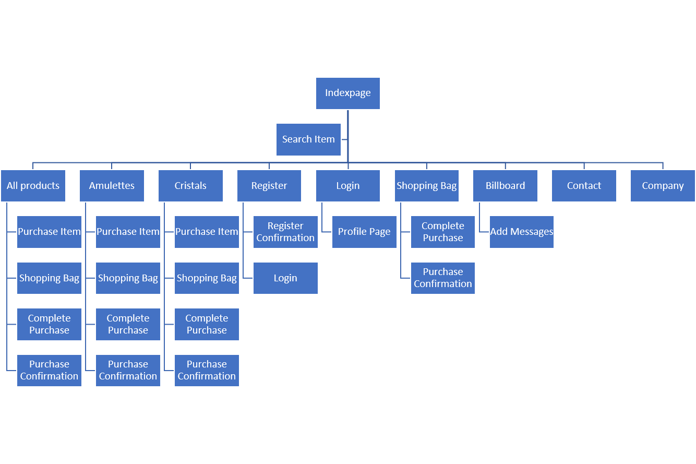
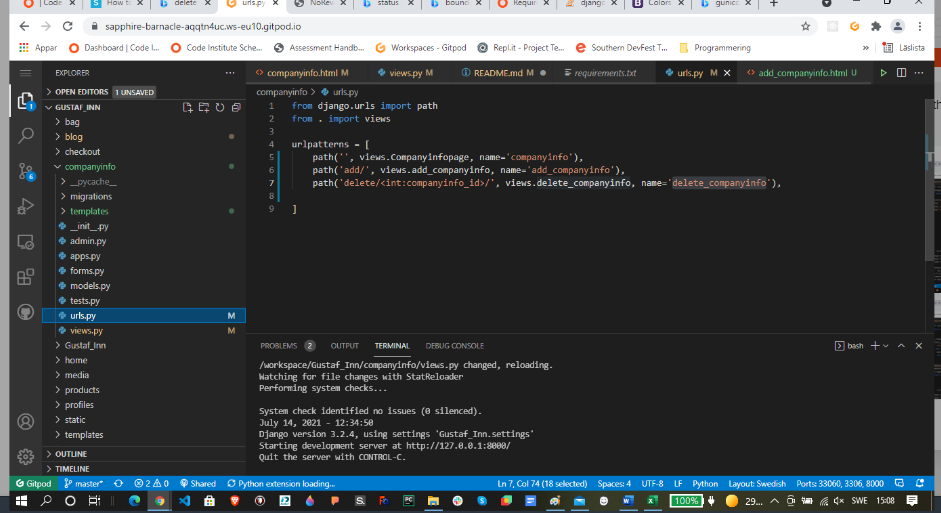
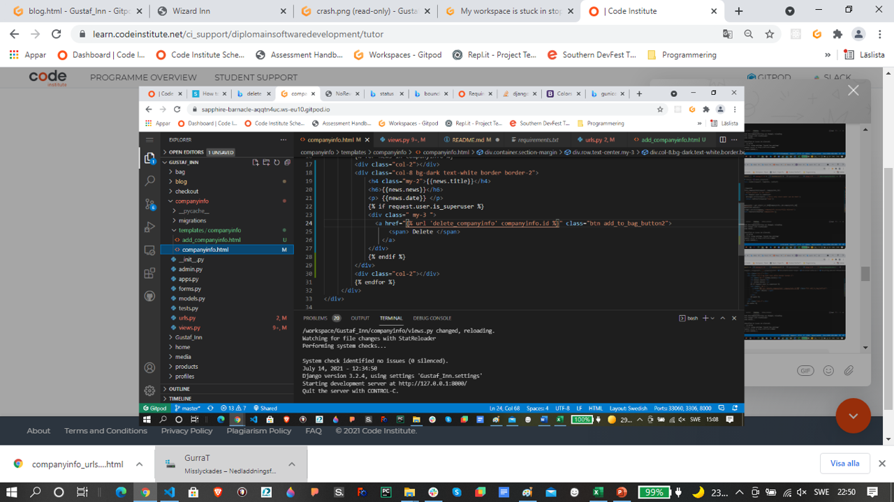
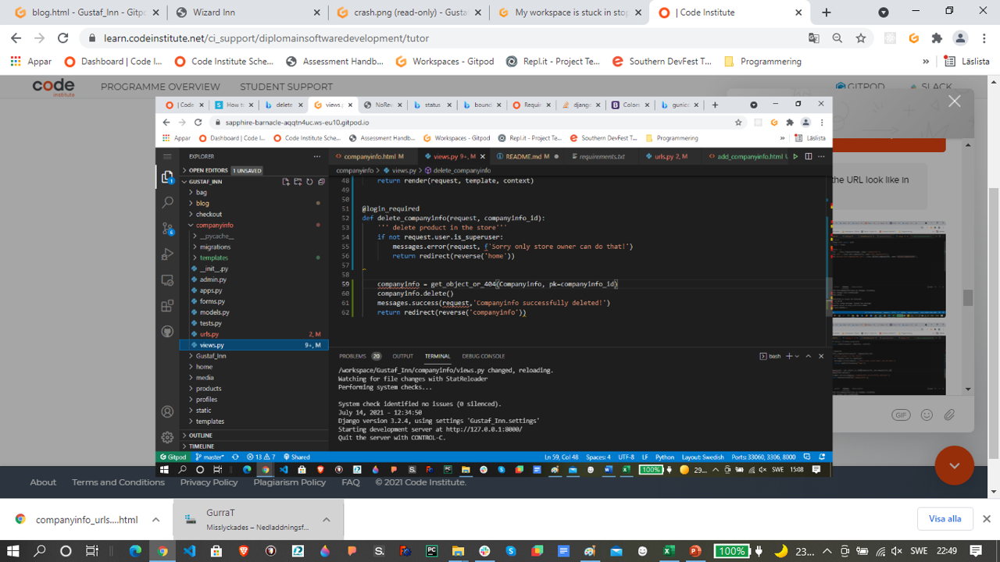
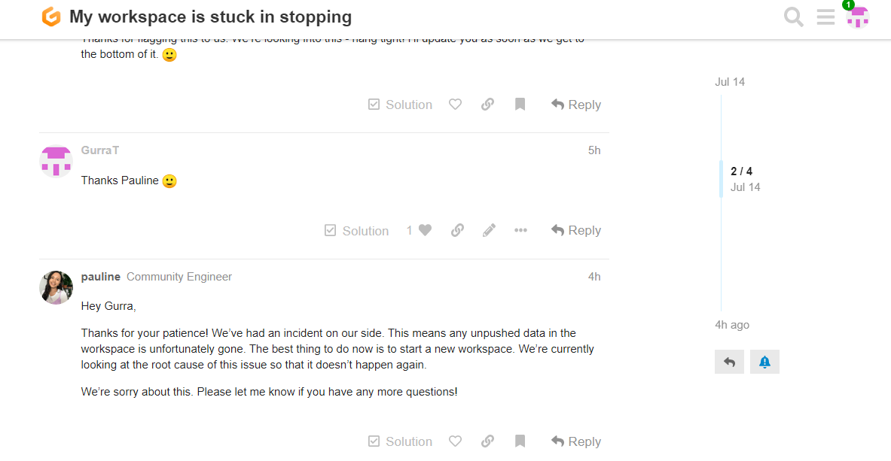

# Wizard Inn

#### The aim of this website is to offer trading-platform were users can search, select and buy items with extraordinary properties such as magic amulettes. Users will be able to search for specific items, select items of interest, add them to a shopping bag and buy items of interest. Bought items will be confirmed by email and sent to prefered delivery adress. Furthermore user will be able to set up their own profile space were they can for instance get shopping histories. The code for this project is found [here](https://dashboard.heroku.com/apps/gustaf-inn "Link to Wizard Inn deployed homepage")

------
-----

## UX(User Experience)

### Project Goal

#### The goal of this project is to build an interactive and responsive trading platform allowing users to search, select, add and buy items. Additionally, users will be able to set up their own profile page where they can find for example earlier shopping histories.

#### The features on the website will:
- Give users the possibility to search, select and buy items
- Give superusers such as store owner a chance to create, update, delete and edit product information
- Give users an opportunity to create their own profile page and see earlier shopping history

#### I will achieve this by:
- By allowing user to search, select and buy items and add their delivery information on a shipping form
- By allowing user to edit their shopping bag
- By allowing registered user to see their shopping history
- By allowing users to get an confirmation email when they order an item
- By allowing superuser such as storeowner to add, delete, edit and update information such as product details and user profiles

## User Goal

#### I expect this website to be used by the following personas
- People who are interested and curious of buying mystic items such as cristals and magic amulettes. Their age span is supposed to be between 25 and 65 years old.

### User Stories

#### As a person interested in mystic items, I want to have a website where 

1.	I can find, select and buy items such as amulettes and cristals (see our stock pages [here]( https://totebo.herokuapp.com/get_stockinfo  "Example from stocks page"))
2.	I search for items connected to my interest (see our stock pages [here]( http://totebo.herokuapp.com/profile/user  "Example from profile page"))
3.	I order and buy and see prices for items of my interest (see our stock pages [here]( http://totebo.herokuapp.com/toolbox "Example from profile page"))
4. I can get an orderinformation sent by email when buying an item
5. I can pay and make sure to get my items delivered when making an order
6. I can see how much i spent on my items of interest
7. I can see earlier shopping history

#### As store owner or superuser I want to have a website where....
1.	I can create, update, add and delete products on the the page
2.	I can receive order information with payment and shipping details
3.	I can see information about users
4.  I can add and delete information about the boutique

-----

### Design Choices

#### Typology

#### Fonts 
I used standards fonts and fonts connected to [bootstrap]( https://getbootstrap.com/ ) as well as Oleo Script from [Google Fonts]( https://fonts.google.com/ ) to create a predictive behaviour of my font over several web browsers but also give some personality to my titles

#### Colors

I focused mainly on black, white, gray colortheme to create a clear, simple and easy to read webpage, the aim is that background image should draw attention to the products and main messages

#### Wireframe
[Wireframe](static/documentation/ShopInn.pdf "Wireframe Wizard Inn")

#### Databases
I used [Postgres](https://www.postgresql.org/ "Postgres") for relational databasehandling

## Technologies Used

### Languages

- HTML5
  - Used as the main mark-up language for the website content.
- CSS3
  - Used to style the individual webpages.
- Python
  - Used for setting up environment and conditions for running the application
- JavaScript
  -  Used for connecting activate functions such as imagehandling in forms and carousell at the homepage

...

### Frameworks

- Django 
  - Used as the main framework to construct this plattform
- Amazon s3
  - Used as a storage place for media files and informations sent to the platform
- Amazon IAM
  - Used to handling userprofile, premissions and access control for users on the trading platform

### Libraries

...
- Gitignore
  - Used to formatting code while constructing the webpage and storing sensitive information
- Pillow
  - Used for image control
-Gunicorn
  - Used for send send informations between server and act as a Python WSGI HTTP Server
- Boto3
  - Used for create, configure, and manage connection between amazone webservices

### Tools
- Git
  - Git was used for version control by utilising the Gitpod terminal to commit to Git and push to GitHub.
- GitHub
  - Used to store and host the project files after being pushed from Git.
- Gitpod
  - An online IDE linked to the GitHub repository used for the majority of the code development.
- [Heroku]( https://www.heroku.com/)
 - Used as a server for connecting Django with Github and sourcing web pages
- Font-Awesome
  - Used for icons to enhance headings and add emphasis to text.
- Microsoft PowerPoint
  - Used for creating mock-ups for e.g., Topology in readme-file
- Am I Responsive?
  - A tool for taking a quick snapshot of the responsive breakpoints of the website to visualise how the site will look on different device screen sizes in one place. The resulting screenshot is also used as the README.md logo image.

---

## Features

### Features Implemented

- Responsive mobile first design 
- User friendly with balanced use of image addressing the core message with the web pages 
- A Navbar with easy navigation that collapses on mobile displays
- A search field for searching products and information connected to products
- Product views with ability to selected and order products
- Profile page with ability to see orderhistory
- Review page with ability to add reviews connected to the platform
- Companyinfo page where store owner can add relevant information
- A Productmanagement page where store owner can add, update and delete products on the platform

### Future Features

- Restore CompanyInfo folder with  urls , template , views  and model lost during GitPod crash 
- Possiblity for store owner to comment reviews
- Possibility for store owner to update company information instead of deletign the and adding new information
- Messages for on empty pages with information to e.g. add more products in shopping bag
- Add more intuative pictures to messages
---

## Version Control

### Version control for this repository is managed within GitHub and Gitpod using main as main branch for the project

- To start with a New Repository was created in GitHub, named [Gustaf_Inn](https://github.com/GurraT/Gustaf_Inn.git)
- Gustaf_Inn was additionally linked to Gitpod pressing the green button Gitpod in the newly created Repository
- Gitpod was then used as an editor for creating the code in this project

### Setting up Django was done in agreement with following step

-	Django was intialized adding following statement in the gitpod terminal
    - pip3 install django
    - django-admin startproject Gustaf_Inn
- To store sensitive information I created a gitignore-file adding following statement in terminal
    - touch .gitignore
- In order to create my apps where i stored my information such url-pathway, models, views and forms I added following statement in the terminal
    - python3 manage.py startapp "appname"
- In order to active my apps I added url apps name to INSTALLED_APPS in settings in the folder Gustaf_Inn 
- In addition I also added the urls to urlpatterns in the Folder Gustaf_Inn
- For most folder app I started with creating a model
- For most model I connected them to an admin view writing my code in each app folders admin
- To use the information from the admin database I created a form in each app folder
- Informations from the model and forms was than added to each folders view and linked to templates within the app folders template folder
- To activate the template I added a path in the urls.py in each folder

### Setting up template and static folder
- In order to built my trading platform i used a basetemplate stored in the template folder called base.html, this template was used to link all metatags, base css-code, links to googlefonts, fontawesome and webservices as stripe
- I also created a static folder were i stored my image files, my css and my documentations

### Setting up a super.user and builtin authentication system 
- In order to login in to my admin page and to set up function specific for my store owner i created a super.user adding following statement to the git pod terminal
    
    - python3 manage.py create a superuser 

- Furthermore I sat up an authentication system adding following statement to the git pod terminal
    - pip3 install django-allauth

-  The alluath templates were stored in the template folder
- To active the allauth I added following statement in the settings folder in Gustaf_Inn
    'django.contrib.auth',
    'django.contrib.messages',
    'django.contrib.sites',
    'allauth',
    'allauth.account',
    'allauth.socialaccount',

- EMAIL_BACKEND = 'django.core.mail.backends.console.EmailBackend'

ACCOUNT_AUTHENTICATION_METHOD = 'username_email'
ACCOUNT_EMAIL_REQUIRED = True
ACCOUNT_EMAIL_VERIFICATION = 'mandatory'
ACCOUNT_SIGNUP_EMAIL_ENTER_TWICE = True
ACCOUNT_USERNAME_MIN_LENGTH = 3
LOGIN_URL = '/accounts/login/'
LOGIN_REDIRECT_URL ='/'

### Set up model and activate postgres

- Django database was set up using python code and migrated to admin using following code
  - python3 manage.py makemigrations
  - python3 manage.py migrate

- To store the data within postgres relational database following code was conduted within the terminal
  - pip3 install dj_database
  - pip3 install psycopg2-binary

### Setting up AWS s3, IAM
  - Storage space and payment system at amazone was set up in accordance with instruction on amazone homepage, followed by setting up key to amazone service in the git pod settings followed by command stated below in the git terminal
    - pip3 install boto3
    - pip3 install django-storages
- Additionally following information where added to the settings in the Gustaf_inn folder
    -  AWS_STORAGE_BUCKET_NAME = 'Wizard_Inn'
    - AWS_S3_REGION_NAME = 'sts.eu-north-1'
    - AWS_ACCESS_KEY_ID = os.environ.get- ('AWS_ACCESS_KEY')
    - AWS_SECRET_ACCESS_KEY = os.environ.get('AWS_SECRET_ACCESS_KEY') 
    - AWS_S3_CUSTOM_DOMAIN = f'- {AWS_STORAGE_BUCKET_NAME}.s3.amazonaws.com'  

### To be able to push and connected the GitHub repository to Heroku following step was conducted
- A requirement.txt file for running app.py was set up, writing following statement in the gitpod terminal "pip3 freeze -- > requirements.txt"
- After setting up the requirement file a Procfile was constructing telling Heroku that app.py was used as the main file for running the website, this was done via running following command in the gitpod terminal "echo web: python app.py > Procfile"
### To be able to connect Django to Heroku following step was conducted
- In the Heroku under "Setting" the same information as stated in git pod varibles (keys for stripe, amazone, ) was set up
_____________________________

#### Deploying code through Heroku was conducted through by
- First pushing code to github, writing "git add .", "git commit -m "messages" ", "git push" in the gitpod terminal
- To connected the Github repository to Heroku, the deploy menu of the totebo app in Heroku was selected
- Within the deployment menu the icon "connect to GitHUb" was selected followed by selecting the repository "totebo trading" and then choosing "main branch" and select "connect", follow by deploy branch
- To see if the deployment works the icon "view" was pressed

## Testing

- I conducted manual testing and used refactor code to find error and beatify code.

### Manual testing
- [Protocol/Manual testing](static/documentation/Manualtesting.pdf "Manual Testing")

*Manual test has been tried through forcing code to break as well as testing that right code works, e.g. adding condition that is not allowed in forms input and making sure that the validation notice this, further more all pages has been troughly tested by clicking on all functions and making sure the routing and commands work as they should

### Fixed Bugs

- Encounter problem with routing in def toolbox when argument name in colletion categories not found, this was fixed with help from tutors at code institutet through adding following code 

___
    if mongo.db.categories.count_documents({"name": session["user"]}, limit=1) > 0:
            return render_template("toolbox.html", stockinfo=stockinfo, uname=uname)
        return redirect(url_for("profile", username=session["user"]))
  ____

  - Had a backdoor open for user that was not member yet to the member section of the web page, this was fixed by adding follow condition to urls for member section 

  ___
    if "user" in session:

### Know bugs
- Contrast between mainsection background and text can be further optimized but acceptable as it is at the moment
- Some of the image affects the prestanda and could be changed for next version

!!!!!!!!!!!

### Acknowledgements

- Large part of the code is from inspirations from lecture from code institute 

- I am grateful for the feedback and constructive comments I got from my mentor Aaron Sinnott at Code Institute e.g., through helping me setting up a realistic schedule and give me inputs on my design and the functions within my application 
#### I also want to thanks following people

- Philip Magnusson, Carl-Johan Svenlin, Tobias Thomsson, Fredrik Thomsson for beta-testing my webpage and given me constructive feedback on the layout and function
- The support I got through slack community from tutors and fellow students, I specially want to thank Igor, John, Sheryl, Tim and Johann, Jo and Alan tutor me in times of need 